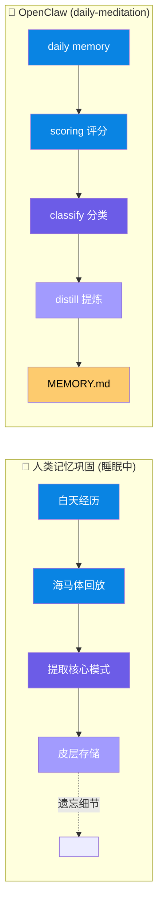
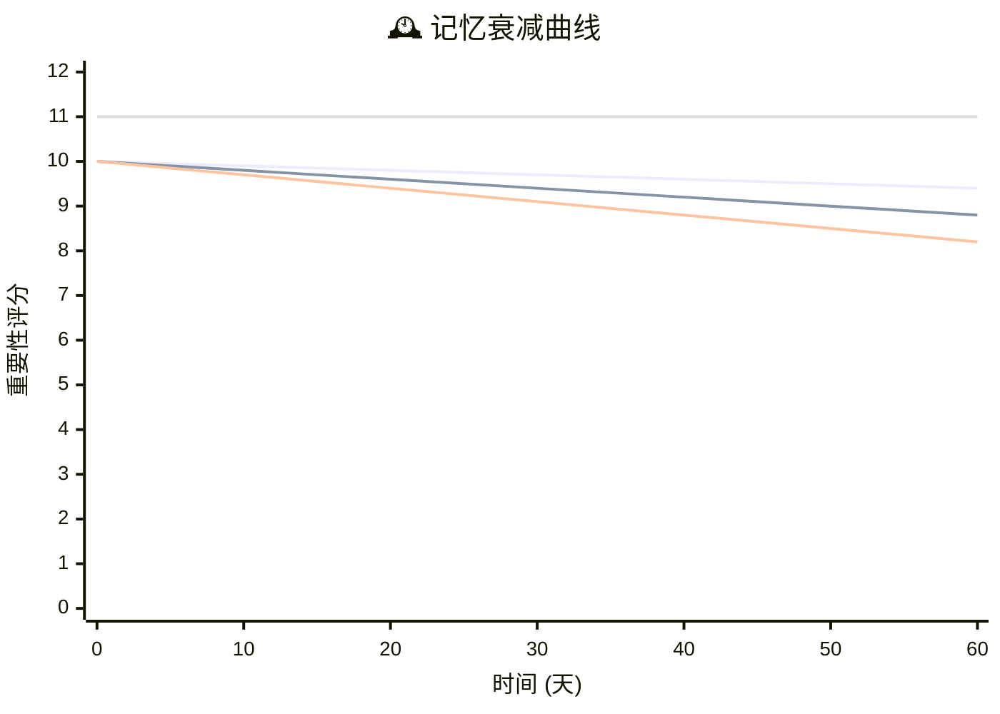

# 🧠 OpenClaw Memory System | 仿生记忆系统

> **让 AI 拥有像人类一样的记忆能力**  
> A biomimetic memory architecture for OpenClaw agents

<div align="center">


</div>

---

## 🌟 项目愿景 | Vision

**人类如何记忆？**

海马体将短期经历编码 → 睡眠中 consolidation（巩固）→ 皮层存储长期记忆 → 随时间衰减遗忘

**AI 如何记忆？**

大多数 AI 助手：把一切写入文件 → 文件越来越多 → 检索越来越慢 → 记忆变成"数据坟墓"

**我们的答案：**

> 模仿人类记忆机制，构建**会遗忘、会提炼、会进化**的 AI 记忆系统

---

## 🔬 仿生学设计原理 | Biomimetic Design

### 1. 双层记忆结构 (Two-Layer Architecture)

<div align="center">


</div>

| 人类大脑 | OpenClaw 记忆系统 | 功能 |
|---------|------------------|------|
| **海马体** (短期记忆) | `memory/YYYY-MM-DD.md` | 存储原始经历、执行日志、反思草稿 |
| **大脑皮层** (长期记忆) | `MEMORY.md` | 存储提炼后的认知、规则、决策 |
| **突触修剪** | `memory-decay-check.py` | 定期清理低复用内容 |

**设计洞察**：
> 人类的长期记忆不是"高分事件的集合"，而是**经过压缩的认知索引**。  
> 同样，`MEMORY.md` 不应是日志仓库，而应是**可复用的智慧结晶**。

---

### 2. 记忆巩固机制 (Memory Consolidation)

<div align="center">



</div>

**v2.3 核心升级**：
- ❌ 旧模式：`高分 → 直接进入主记忆`
- ✅ 新模式：`候选评分 → 类型判断 → 长期价值评估 → 提炼固化`

---

### 3. 遗忘机制 (Forgetting Mechanism)

<div align="center">



</div>

| 遗忘类型 | 人类机制 | OpenClaw 实现 |
|---------|---------|--------------|
| **衰退性遗忘** | 突触连接随时间减弱 | `decay.py` 每日衰减评分 |
| **干扰性遗忘** | 相似记忆相互抑制 | 去重检测，避免重复插入 |
| **动机性遗忘** | 情绪调节主动压抑 | 低复用事件标记清理 |
| **提取失败** | 线索不足无法回忆 | 搜索命中追踪，低命中预警 |

**设计哲学**：
> 遗忘不是缺陷，而是**认知效率的必要条件**。  
> 一个不会遗忘的记忆系统，最终会被噪音淹没。

---

### 4. 记忆评分系统 (Scoring System)

```
重要性评分 (1-10 分)
├── 1-3 分：琐碎日常 → 快速衰减 (-0.03/天)
├── 4-6 分：普通事件 → 正常衰减 (-0.02/天)
├── 7-10 分：重要认知 → 温和衰减 (-0.01/天)
└── ≥11 分：核心记忆 → 永不衰减 (长期存储)
```

**评分维度**：
- 🔍 **可复用性**：未来是否会被再次引用？
- 📌 **稳定性**：是长期事实还是临时状态？
- 🎯 **决策价值**：是否影响未来行为？
- 📚 **规则性**：是否可抽象为通用原则？

---

## 🏗️ 系统架构 | Architecture

<div align="center">

```mermaid
flowchart TD
    subgraph Daily["📝 Daily Memory Layer"]
        D1[memory/YYYY-MM-DD.md<br/>原始经历 | 执行日志 | 反思草稿 | 临时笔记]
    end
    
    subgraph Scoring["memory-scoring.py"]
        S1[重要性评分 | 候选标记]
    end
    
    subgraph Candidate["候选过滤"]
        C1[importance ≥ 7]
    end
    
    subgraph Consolidation["memory-consolidation.py"]
        CS1[类型判断 | 价值评估 | 提炼固化]
    end
    
    subgraph Main["🧠 Main Memory Layer"]
        M1[MEMORY.md<br/>长期事实 | 重要决策 | 可复用规则 | 提炼认知]
    end
    
    subgraph Decay["memory-decay-check.py"]
        DC1[遗忘审计 | 清理建议]
    end
    
    Daily --> Scoring
    Scoring --> Candidate
    Candidate --> Consolidation
    Consolidation --> Main
    Main -.->|定期审计 | Decay
    
    style Daily fill:#74b9ff,stroke:#0984e3,color:white
    style Scoring fill:#0984e3,stroke:#06528f,color:white
    style Candidate fill:#fdcb6e,stroke:#e17055,color:black
    style Consolidation fill:#6c5ce7,stroke:#4834d4,color:white
    style Main fill:#a29bfe,stroke:#6c5ce7,color:white
    style Decay fill:#d63031,stroke:#c0392b,color:white
```

</div>

---

## 📂 项目结构 | Structure

```
openclaw-memory-system/
├── README.md                          # 项目说明（本文件）
├── memory-bionics-system.md           # 系统规范文档
├── scripts/
│   ├── memory-scoring.py              # 前端评分
│   ├── memory-consolidation.py        # 后端提炼
│   ├── memory-decay-check.py          # 遗忘审计
│   ├── memory-usage-tracker.py        # 使用追踪
│   ├── daily-memory-maintenance-instructions.md
│   └── daily-meditation-instructions.md
└── examples/
    └── decay-report.json.example
```

---

## 🚀 快速开始 | Quick Start

### 1. 阅读文档
```bash
# 阅读顺序
1. README.md
2. memory-bionics-system.md
3. scripts/daily-memory-maintenance-instructions.md
4. scripts/daily-meditation-instructions.md
```

### 2. 试运行核心流程
```bash
# 评分（最近 3 天，带解释）
python3 scripts/memory-scoring.py --dry-run --explain --recent-days 3

# 提炼（最近 3 天）
python3 scripts/memory-consolidation.py --dry-run --recent-days 3

# 遗忘审计
python3 scripts/memory-decay-check.py --dry-run
```

### 3. 检查关键问题
- [ ] 过程记录是否太容易进入候选集？
- [ ] 提炼是否放入了应留在 daily memory 的内容？
- [ ] 治理输出是否合理？

---

## 🧬 与人类记忆的横向对比 | Comparison

| 特性 | 人类记忆 | 传统 AI 记忆 | OpenClaw 仿生记忆 |
|-----|---------|------------|-----------------|
| **存储策略** | 选择性编码 | 全量存储 | 选择性提炼 |
| **遗忘机制** | 主动衰减 | 无/手动删除 | 自动衰减 + 审计 |
| **巩固过程** | 睡眠中回放 | 无 | daily-meditation |
| **提取线索** | 多模态关联 | 关键词匹配 | 搜索命中追踪 |
| **容量限制** | 有限 (7±2) | 理论上无限 | 紧凑索引约束 |
| **情绪影响** | 强烈调节 | 无 | 可扩展情绪权重 |
| **可塑性** | 持续重构 | 静态存储 | 动态更新 + 合并 |

---

## 🎯 设计原则 | Design Principles

### 1. 紧凑性优先 (Compactness First)
> `MEMORY.md` 是认知索引，不是数据仓库。  
> 能用一句话总结的，就不要保留整段过程。

### 2. 遗忘即智慧 (Forgetting is Wisdom)
> 不会遗忘的系统，终将被噪音淹没。  
> 定期清理低复用内容，保持记忆活力。

### 3. 提炼胜于存储 (Distillation over Dumping)
> 原始经历 → 提炼认知  
> 不是"发生了什么"，而是"学到了什么"。

### 4. 可复用性驱动 (Reusability Driven)
> 记忆的价值不在于"记住"，而在于"能用"。  
> 搜索命中和使用引用是核心评分信号。

---

## 📊 当前版本 | Current Version

**v2.3** - 紧凑认知索引方向

**核心改进**：
- ✅ 评分仅作为候选信号，非直接准入
- ✅ 类型判断 + 长期价值评估双重过滤
- ✅ 治理检查保持 `MEMORY.md` 紧凑
- ✅ 阻止过程记录进入主记忆
- ✅ 支持规则/决策片段合并建议

---

## 📝 使用场景 | Use Cases

### ✅ 适合存储到 MEMORY.md
- 长期有效的事实（如 API 配置、服务地址）
- 重要决策及其原因
- 可复用的规则和原则
- 经过提炼的认知模式

### ❌ 不适合存储到 MEMORY.md
- 单次执行过程日志
- 临时性状态信息
- 未提炼的原始反思
- 系统设计文档本身（应放在单独文件）

---

## 🤝 新维护者交接 | Handoff

新 Agent 或维护者接手时，请按此顺序：

1. **阅读文档**
   - 本文件
   - `memory-bionics-system.md`
   - 两个 instruction 文件

2. **试运行完整流程**
   ```bash
   python3 scripts/memory-scoring.py --dry-run --explain --recent-days 3
   python3 scripts/memory-consolidation.py --dry-run --recent-days 3
   python3 scripts/memory-decay-check.py --dry-run
   ```

3. **回答三个问题**
   - 过程记录是否太容易进入候选集？
   - 提炼是否放入了应留在 daily memory 的内容？
   - 治理输出是否合理？

4. **确认后再执行非 dry-run 操作**

---

## 📄 许可证 | License

MIT License

---

## 🌙 关于本项目 | About

本项目由 OpenClaw 社区开发，旨在为 AI 助手构建**类人记忆机制**。

> **核心理念**：记忆不是存储，而是**可提取、可复用、可进化**的认知资产。

---

<div align="center">

**🧠 让 AI 的记忆像人类一样聪明**

*Built with biomimetic principles for OpenClaw agents*

</div>
