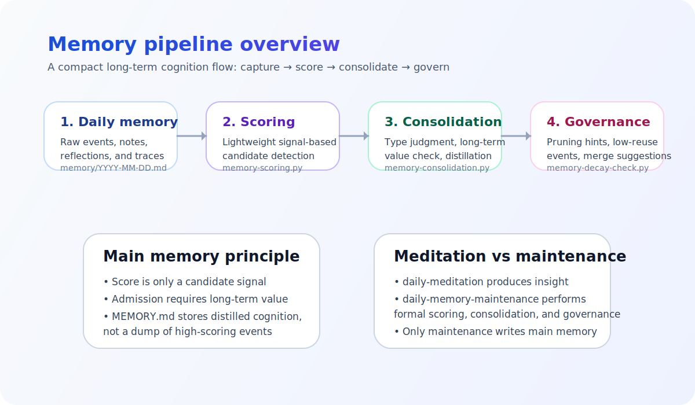

<p align="center">
  
</p>

<h1 align="center">OpenClaw Memory System</h1>

<p align="center">
  A biomimetic memory workflow for OpenClaw agents.<br/>
  Turn raw daily experience into a compact long-term cognition index.
</p>

<p align="center">
  
  
  
  
</p>

---

## Overview

This repository contains a practical memory architecture for OpenClaw that separates:

- **daily memory** (`memory/YYYY-MM-DD.md`) for raw experience, logs, and reflections
- **main memory** (`MEMORY.md`) for distilled long-term facts, rules, and decisions
- **governance scripts** for scoring, consolidation, forgetting, and pruning suggestions

> Long-term memory should not be a dump of high-scoring events.  
> It should be a compact index of durable cognition.

---

## Design baseline

**Current public baseline:** `v2.3`

### What v2.3 changes

| Layer | Role | Key idea |
|------|------|----------|
| Daily memory | Capture | Keep raw context, traces, and reflections |
| Scoring | Candidate detection | Score first, but treat score only as a **signal** |
| Consolidation | Long-term admission | Write into `MEMORY.md` only after **type judgment** and **long-term value judgment** |
| Governance | Compression and review | Keep `MEMORY.md` compact through pruning, merge suggestions, and low-reuse checks |

---

## Visual architecture

<p align="center">
  
</p>

---

## Core principles

### 1. Markdown remains the source of truth
The active memory system is still grounded in plain files:

- `memory/YYYY-MM-DD.md`
- `MEMORY.md`

### 2. Score does not equal admission
A high score means:
- this entry may be worth reviewing

It does **not** mean:
- this entry automatically deserves long-term memory

### 3. `MEMORY.md` is a cognition index
It should primarily store:
- stable facts
- important decisions
- reusable rules
- distilled long-term cognition

It should **not** become a pile of copied high-scoring events.

---

## Pipeline

```text
memory/YYYY-MM-DD.md
  ↓
memory-scoring.py
  ↓
candidate (importance >= 7)
  ↓
memory-consolidation.py
  ↓
MEMORY.md
  ↓
memory-decay-check.py
  ↓
forgotten items / expired files / pruning suggestions
```

### Daily review path

```text
daily-meditation
  ↓
review yesterday
  ↓
write new insights back to the dated daily memory file
  ↓
wait for the next maintenance cycle to score and consolidate
```

---

## Repository layout

```text
openclaw-memory-system/
├── README.md
├── memory-bionics-system.md
├── assets/
│   └── readme/
│       ├── hero.svg
│       └── architecture.svg
├── scripts/
│   ├── memory-scoring.py
│   ├── memory-consolidation.py
│   ├── memory-decay-check.py
│   ├── memory-usage-tracker.py
│   ├── daily-memory-maintenance-instructions.md
│   └── daily-meditation-instructions.md
└── examples/
    └── decay-report.json.example
```

---

## Core files

### `memory/YYYY-MM-DD.md`
Use daily memory for:
- raw events
- debugging traces
- reflections
- drafts before long-term consolidation

### `MEMORY.md`
Use main memory for:
- stable facts
- important decisions
- reusable rules
- distilled long-term cognition

Do **not** use it as a design document.

### `memory-bionics-system.md`
This is the formal system specification.

Use it to understand:
- boundaries
- file roles
- cron responsibilities
- end-to-end flow
- handoff guidance

---

## Scripts at a glance

| Script | Purpose |
|--------|---------|
| `memory-scoring.py` | Front-end scoring and candidate detection |
| `memory-consolidation.py` | Type judgment, long-term value check, distilled insertion |
| `memory-decay-check.py` | Governance audit: forgotten items, duplicates, low-reuse events, merge suggestions |
| `memory-usage-tracker.py` | Tracks usage signals such as search hits and citations |

### `memory-scoring.py`
Current behavior:
- candidate threshold = `importance >= 7`
- dynamic entry score cap = `10`
- supports `--dry-run`, `--explain`, `--recent-days`

### `memory-consolidation.py`
Responsibilities:
- read scored daily memory candidates
- classify entry type (`fact`, `decision`, `rule`, `event`, `doc`, `log`)
- judge long-term value
- distill and insert into `MEMORY.md`
- avoid duplicate insertions

### `memory-decay-check.py`
Responsibilities:
- detect forgotten main-memory entries
- detect expired daily-memory files
- generate pruning suggestions
- surface low-reuse event cleanup and merge opportunities

---

## Cron role split

### `daily-memory-maintenance`
Runs the formal maintenance pipeline:
- usage analysis
- scoring
- consolidation
- governance audit

### `daily-meditation`
Runs the reflective review pipeline:
- review yesterday
- generate lessons / improvements / plans
- write insight material back to the corresponding dated daily memory file
- publish diary or summary if needed

> `daily-meditation` should not write directly into `MEMORY.md`.

---

## Public repository policy

This repository is intentionally generic and sanitized.

It does **not** include:
- private identities
- private user ids
- personal credentials
- private service endpoints
- local machine-specific memory content

You are expected to adapt the scripts and instruction files to your own OpenClaw workspace.

---

## Suggested handoff sequence

If a new maintainer or agent needs to take over, read in this order:

1. `README.md`
2. `memory-bionics-system.md`
3. `scripts/daily-memory-maintenance-instructions.md`
4. `scripts/daily-meditation-instructions.md`
5. run the core dry-runs:

```bash
python3 scripts/memory-scoring.py --dry-run --explain --recent-days 3
python3 scripts/memory-consolidation.py --dry-run --recent-days 3
python3 scripts/memory-decay-check.py --dry-run
```

---

## License

MIT
